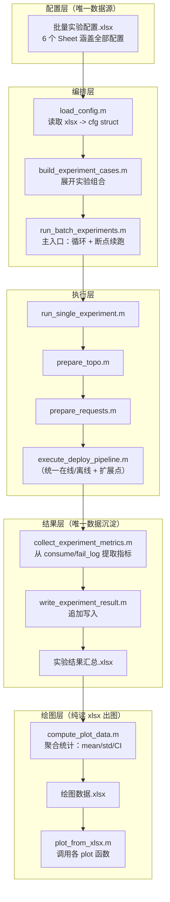
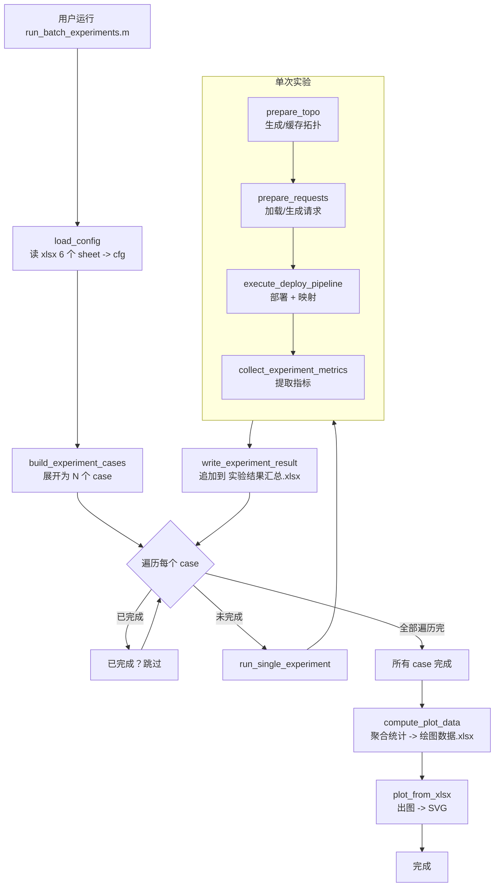

# MATLAB VNF 仿真平台 -- 批量实验重构方案（无兼容版）

---

## 第1部分：当前架构问题诊断

### 1.1 配置散落在 4 个 .m 函数中

- `getTopoCfg.m` -- 拓扑参数（节点资源范围、路径等）
- `getReqCfg.m` -- 请求参数（请求数量、VNF配置、时延范围等）
- `getDeployMethodCfg.m` -- 方法定义（函数名、路径模板、算法参数等），约 160 行 switch-case
- `getPlotCfg.m` -- 绘图配置（图例映射、对比方法白名单等）

**问题**：新增拓扑/方法必须改代码，参数调整必须改代码，无法在不启动 MATLAB 的情况下查看/修改配置。

### 1.2 4 个脚本串行手动执行

`topoAndRequest.m` -> `deployAndDispatchPlan.m` -> `sfcMapping.m` -> `resultPlot.m` 必须逐一手动运行，每个脚本头部硬编码 `topoName` 和 `deployMethodName`。

### 1.3 在线/离线模式分叉

`deployAndDispatchPlan.m` 和 `sfcMapping.m` 中都有 `onlineMode` 分支。在线模式下 sfcMapping 实质上是空操作（只加载已有结果），增加了理解和维护成本。

### 1.4 结果以分散 .mat 存储

结果分散在 `c.输出/4.资源消耗与失败日志/{方法编号}/{拓扑}/` 下，无法区分不同参数配置、不同请求集、不同重复次数，无法做多次重复实验的统计聚合。

### 1.5 绘图函数内部混合指标计算

10 个 `plot_xxx.m` 函数每个都是"从 consume/requests 算指标 + 画图 + 保存"三合一，无法独立调用指标计算或独立出图。

---

## 第2部分：目标架构设计

**核心原则：一个 xlsx 配全部，一个入口跑全部，一个 xlsx 存全部，一个入口画全部。**




### 各层职责一览

- **配置层**：`批量实验配置.xlsx` 是唯一配置源。废弃 `getTopoCfg.m`、`getReqCfg.m`、`getDeployMethodCfg.m`、`getPlotCfg.m`
- **编排层**：`load_config.m` 读 xlsx 产出 cfg struct；`build_experiment_cases.m` 展开所有组合；`run_batch_experiments.m` 是唯一主入口
- **执行层**：`run_single_experiment.m` 编排单次实验全流程；`execute_deploy_pipeline.m` 统一封装在线/离线/未来RL分支
- **结果层**：`collect_experiment_metrics.m` 从内存中的 consume/fail_log/requests/nodes 提取指标；`write_experiment_result.m` 写入 `实验结果汇总.xlsx`
- **绘图层**：`compute_plot_data.m` 从汇总 xlsx 按分组聚合；`plot_from_xlsx.m` 从 `绘图数据.xlsx` 调用各绘图函数出图

---

## 第3部分：新目录结构

```
02-实验代码/
├── a.输入/
│   ├── 1.原始拓补信息/          （保留不变：Abilene.m, US_Backbone.m 等）
│   └── 批量实验配置.xlsx         ★ 唯一配置文件（6 个 Sheet）
│
├── b.常用函数/
│   ├── 1.拓补信息提取函数/        （保留不变）
│   ├── 2.请求生成函数/            （保留不变）
│   ├── 3.部署方案生成/            （保留不变：全部算法函数）
│   ├── 5.sfc映射/                 （保留不变）
│   ├── 6.结果绘制/
│   │   ├── 1.工具函数/
│   │   │   ├── calcFigureSize.m   （保留）
│   │   │   ├── ensure_dir.m       （保留）
│   │   │   └── save_svg.m         （保留）
│   │   └── 2.绘图函数/             ★ 重写：全部改为纯绘图（输入 table，不再算指标）
│   │       ├── plot_acceptance_rate_bar.m
│   │       ├── plot_avg_metric_vs_success.m    （统一模板：cpu/mem/bw/delay/slack）
│   │       ├── plot_blocking_rate_curve.m
│   │       ├── plot_cumulative_resource.m
│   │       ├── plot_failure_distribution.m
│   │       ├── plot_vnf_sharing_gain.m
│   │       └── plot_gantt_chart.m              （保留，仍需 nodes struct）
│   │
│   └── 7.批量实验框架/             ★ 核心新增
│       ├── load_config.m
│       ├── read_global_cfg.m          ★ 供绘图函数独立运行时读取绘图参数
│       ├── build_experiment_cases.m
│       ├── run_single_experiment.m
│       ├── prepare_topo.m
│       ├── prepare_requests.m
│       ├── execute_deploy_pipeline.m
│       ├── collect_experiment_metrics.m
│       ├── write_experiment_result.m
│       ├── compute_plot_data.m
│       └── plot_from_xlsx.m
│
├── c.输出/
│   ├── 1.拓补信息/                （保留：缓存 topo .mat）
│   ├── 2.请求信息/                （保留：缓存 request .mat）
│   ├── 5.结果图保存/              （保留：SVG 输出目录）
│   ├── 实验结果汇总.xlsx           ★ 唯一原始实验数据
│   └── 绘图数据.xlsx              ★ 聚合后绘图数据
│
├── run_batch_experiments.m         ★ 唯一主入口
└── 修改说明.md                      ★ 重构文档
```

### 删除的文件/目录


| 删除项                                                 | 原因                                       |
| --------------------------------------------------- | ---------------------------------------- |
| `b.常用函数/0.配置函数/` 整个目录                               | 4 个配置函数全部废弃，配置统一收入 xlsx                  |
| `b.常用函数/6.结果绘制/2.计算指标/`                             | 指标计算逻辑统一到 `collect_experiment_metrics.m` |
| `b.常用函数/6.结果绘制/runThesisResultPlots.m`              | 被 `plot_from_xlsx.m` 替代                  |
| `b.常用函数/6.结果绘制/1.工具函数/loadMethodResultsFromPaths.m` | 不再从 .mat 加载                              |
| `b.常用函数/6.结果绘制/1.工具函数/exportMetricsToExcel.m`       | 指标导出由 `write_experiment_result.m` 统一完成   |
| `d.基础实验单元/` 整个目录                                    | 4 个旧脚本被新框架完全替代                           |
| `c.输出/3.部署方案/`                                      | 不再保存中间 plan .mat                         |
| `c.输出/4.资源消耗与失败日志/`                                 | 不再保存分散的 result.mat                       |


---

## 第4部分：统一数据模型设计

### 4.1 批量实验配置 (`a.输入/批量实验配置.xlsx`)

**Sheet 1: "实验组合" -- 定义要跑哪些实验**


| 字段              | 类型     | 说明                 | 示例                            |
| --------------- | ------ | ------------------ | ----------------------------- |
| group_id        | string | 实验组标识              | "G1"                          |
| topo_name       | string | 拓扑名（对应"拓扑配置"sheet） | "US_Backbone"                 |
| method_name     | string | 方法名（对应"方法配置"sheet） | "ResourceAndDelayAwareOnline" |
| param_group     | string | 方法参数组标识（同一方法不同参数）  | "default"                     |
| request_set_ids | string | 请求集编号列表，逗号分隔       | "1,2,3"                       |
| repeat_count    | int    | 每个组合重复次数           | 5                             |
| enabled         | int    | 1=启用, 0=跳过         | 1                             |


**Sheet 2: "拓扑配置" -- 取代 getTopoCfg.m**


| 字段        | 示例值 (US_Backbone) | 示例值 (Abilene) |
| --------- | ----------------- | ------------- |
| topo_name | US_Backbone       | Abilene       |
| topo_func | US_Backbone       | Abilene       |
| minm      | 80                | 40            |
| maxm      | 120               | 80            |
| minc      | 80                | 40            |
| maxc      | 120               | 80            |
| minb      | 160               | 100           |
| maxb      | 320               | 200           |


**Sheet 3: "请求配置" -- 取代 getReqCfg.m**


| 字段             | 示例值 (US_Backbone) | 示例值 (Abilene) |
| -------------- | ----------------- | ------------- |
| topo_name      | US_Backbone       | Abilene       |
| requests_num   | 100               | 100           |
| destNode_count | 5                 | 5             |
| vnftype_num    | 8                 | 8             |
| vnf_num        | 3                 | 3             |
| maxbw          | 8                 | 24            |
| minbw          | 2                 | 6             |
| maxnr          | 4                 | 4             |
| minnr          | 1                 | 1             |
| maxt           | 250               | 100           |
| mint           | 100               | 50            |


**Sheet 4: "方法配置" -- 取代 getDeployMethodCfg.m**


| 字段            | STB                  | NIF                | RSA                | RDA                         |
| ------------- | -------------------- | ------------------ | ------------------ | --------------------------- |
| method_name   | shortestPathFirst... | nodeFirst          | RSA                | ResourceAndDelay...Online   |
| display_name  | STB                  | NIF                | RSA                | RDA                         |
| deploy_func   | shortestPathFirst... | nodeFirst          | RSA                | ResourceAndDelayAwareOnline |
| requests_type | sortedRequests       | requests           | sortedRequests     | sortedRequests              |
| fixed_func    | FixedTreePlan        | FixedTreePlan      | FixedTreePlan      | FixedTreePlan               |
| sorted_func   | generateDeployPlan   | generateDeployPlan | generateDeployPlan | generateDeployPlan          |
| online_mode   | 0                    | 0                  | 0                  | 1                           |


**Sheet 5: "方法参数组" -- 支持同一方法不同参数对比**


| 字段            | 说明     | 示例                          |
| ------------- | ------ | --------------------------- |
| method_name   | 方法名    | ResourceAndDelayAwareOnline |
| param_group   | 参数组标识  | "default"                   |
| candLinkNum   | 候选路径数  | 5                           |
| candNodeNum   | 候选节点数  | 5                           |
| shareWeight   | 共享权重   | 1                           |
| congWeight    | 拥塞权重   | 1.0                         |
| delayWeight   | 时延权重   | 3.0                         |
| shareDecayMin | 共享衰减下限 | 0                           |


**Sheet 6: "全局设置"**


| 字段             | 值           | 说明                              |
| -------------- | ----------- | ------------------------------- |
| rng_seed_base  | 42          | 随机种子基数（seed = base + repeat_id） |
| output_dir     | c.输出        | 输出根目录                           |
| summary_xlsx   | 实验结果汇总.xlsx | 汇总文件名                           |
| plot_data_xlsx | 绘图数据.xlsx   | 绘图数据文件名                         |
| fig_visible    | off         | 绘图时是否弹窗                         |
| save_svg       | 1           | 是否保存 SVG                        |
| fig_width      | 800         | 图宽(px)                          |
| fig_height     | 600         | 图高(px)                          |
| line_width     | 1.8         | 线宽                              |
| font_size      | 12          | 字号                              |


### 4.2 单次实验案例模型（内存中的 struct）

```matlab
experiment_case = struct( ...
    'case_id',          '',       ... % "G1_USB_RDA_default_R1_rep3"
    'group_id',         '',       ...
    'topo_name',        '',       ...
    'method_name',      '',       ...
    'display_name',     '',       ...
    'param_group',      '',       ...
    'request_set_id',   0,        ...
    'repeat_id',        0,        ...
    'seed',             0,        ...
    'topo_cfg',         struct(), ... % 从 xlsx "拓扑配置" sheet 读出
    'req_cfg',          struct(), ... % 从 xlsx "请求配置" sheet 读出
    'method_cfg',       struct(), ... % 从 xlsx "方法配置"+"方法参数组" 合并
    'global_cfg',       struct()  ... % 从 xlsx "全局设置" 读出
);
```

### 4.3 实验结果汇总 (`c.输出/实验结果汇总.xlsx`)

**Sheet 1: "实验元数据" -- 每次实验一行**


| 字段              | 说明                  |
| --------------- | ------------------- |
| case_id         | 唯一标识                |
| group_id        | 实验组                 |
| topo_name       | 拓扑                  |
| method_name     | 方法原名                |
| display_name    | 方法图例名               |
| param_group     | 参数组                 |
| request_set_id  | 请求集编号               |
| repeat_id       | 重复编号                |
| seed            | 随机种子                |
| run_timestamp   | 运行时间戳               |
| elapsed_seconds | 耗时(秒)               |
| status          | "success" / "error" |


**Sheet 2: "汇总指标" -- 每次实验一行**


| 字段                 | 来源                                  |
| ------------------ | ----------------------------------- |
| case_id            | 关联键                                 |
| total_requests     | numel(requests)                     |
| accepted_count     | sum([consume.accepted])             |
| rejected_count     | 差值                                  |
| acceptance_rate    | 比值                                  |
| avg_cpu            | mean(accepted 的 cpu_consume)        |
| avg_memory         | mean(accepted 的 memory_consume)     |
| avg_bandwidth      | mean(accepted 的 bandwidth_consume)  |
| avg_e2e_delay      | mean(accepted 的 e2e_delay)          |
| avg_slack_ratio    | mean((max_delay - e2e) / max_delay) |
| total_cpu          | sum(accepted 的 cpu_consume)         |
| total_memory       | sum                                 |
| total_bandwidth    | sum                                 |
| vnf_sharing_gain   | 计算值                                 |
| fail_lack_bw       | 因带宽不足失败次数                           |
| fail_lack_cpu      | 因 CPU 不足失败次数                        |
| fail_lack_mem      | 因内存不足失败次数                           |
| fail_timeout       | 因超时失败次数                             |
| fail_unschedulable | 因不可调度失败次数                           |


**Sheet 3: "请求级明细" -- 每个请求一行（case_id + req_id 联合键）**


| 字段                | 来源                                  |
| ----------------- | ----------------------------------- |
| case_id           | 关联键                                 |
| req_id            | requests(i).id                      |
| deploy_order      | 部署顺序（第几个被处理）                        |
| accepted          | consume(rid).accepted               |
| cpu_consume       | consume(rid).cpu_consume            |
| memory_consume    | consume(rid).memory_consume         |
| bandwidth_consume | consume(rid).bandwidth_consume      |
| e2e_delay         | getE2EDelayForRequest 计算值           |
| max_delay         | requests(i).max_delay               |
| slack_ratio       | (max_delay - e2e_delay) / max_delay |
| dest_count        | numel(requests(i).dest)             |
| vnf_count         | numel(requests(i).vnf)              |


### 4.4 绘图数据 (`c.输出/绘图数据.xlsx`)

**Sheet 1: "方法对比汇总" -- 柱状图/表格用**


| 字段                | 说明                                                 |
| ----------------- | -------------------------------------------------- |
| topo_name         | 分组键                                                |
| display_name      | 方法名                                                |
| param_group       | 参数组                                                |
| metric_name       | 指标名（acceptance_rate / avg_cpu / avg_e2e_delay ...） |
| mean              | 多次重复均值                                             |
| std               | 标准差                                                |
| ci95_lo / ci95_hi | 95% 置信区间                                           |
| n                 | 样本数                                                |


**Sheet 2: "逐请求曲线" -- 折线图用**


| 字段                               | 说明            |
| -------------------------------- | ------------- |
| topo_name                        | 分组键           |
| display_name                     | 方法名           |
| param_group                      | 参数组           |
| success_index                    | 第 k 个成功部署（横轴） |
| avg_cpu_mean / avg_cpu_std       | 多次重复的均值/标准差   |
| avg_mem_mean / avg_mem_std       | 同上            |
| avg_bw_mean / avg_bw_std         | 同上            |
| avg_delay_mean / avg_delay_std   | 同上            |
| avg_slack_mean / avg_slack_std   | 同上            |
| block_rate_mean / block_rate_std | 同上            |


**Sheet 3: "失败分布" -- 柱状图用**


| 字段                     | 说明                                                      |
| ---------------------- | ------------------------------------------------------- |
| topo_name              | 分组键                                                     |
| display_name           | 方法名                                                     |
| fail_type              | lack_bw / lack_cpu / lack_mem / timeout / unschedulable |
| count_mean / count_std | 多次重复的均值/标准差                                             |


---

## 第5部分：新执行流程




**关键设计决策：**

1. **拓扑缓存**：`prepare_topo` 使用 `persistent` 变量或传入 cache struct，同一拓扑只生成一次 nodes/links/KPaths
2. **请求缓存**：`prepare_requests` 优先加载 `c.输出/2.请求信息/{topo}/request/request{N}.mat`，不存在时按 seed 生成并保存
3. **在线/离线统一**：`execute_deploy_pipeline` 内部根据 `method_cfg.online_mode` 自动选择路径，对调用方完全透明
4. **指标提取与写入分离**：`collect_experiment_metrics` 返回纯 struct/table，`write_experiment_result` 负责 xlsx I/O
5. **断点续跑**：`run_batch_experiments` 启动时读取已有 `实验结果汇总.xlsx` 中的 case_id 集合，跳过已完成的
6. **绘图完全独立**：`compute_plot_data` + `plot_from_xlsx` 可以在任意时刻独立运行，不需要重跑实验

---

## 第6部分：旧模块迁移映射

### 废弃的旧文件 -> 新替代


| 旧文件                                                 | 处理     | 替代者                                     |
| --------------------------------------------------- | ------ | --------------------------------------- |
| `b.常用函数/0.配置函数/getTopoCfg.m`                        | **删除** | xlsx Sheet "拓扑配置"                       |
| `b.常用函数/0.配置函数/getReqCfg.m`                         | **删除** | xlsx Sheet "请求配置"                       |
| `b.常用函数/0.配置函数/getDeployMethodCfg.m`                | **删除** | xlsx Sheet "方法配置" + "方法参数组"             |
| `b.常用函数/0.配置函数/getPlotCfg.m`                        | **删除** | xlsx Sheet "全局设置"                       |
| `d.基础实验单元/topoAndRequest.m`                         | **删除** | `prepare_topo.m` + `prepare_requests.m` |
| `d.基础实验单元/deployAndDispatchPlan.m`                  | **删除** | `execute_deploy_pipeline.m`             |
| `d.基础实验单元/sfcMapping.m`                             | **删除** | `execute_deploy_pipeline.m`（内部统一）       |
| `d.基础实验单元/resultPlot.m`                             | **删除** | `plot_from_xlsx.m`                      |
| `b.常用函数/6.结果绘制/runThesisResultPlots.m`              | **删除** | `plot_from_xlsx.m`                      |
| `b.常用函数/6.结果绘制/1.工具函数/loadMethodResultsFromPaths.m` | **删除** | 不需要（从 xlsx 读）                           |
| `b.常用函数/6.结果绘制/1.工具函数/exportMetricsToExcel.m`       | **删除** | `write_experiment_result.m`             |
| `b.常用函数/6.结果绘制/2.计算指标/` 整个目录                        | **删除** | `collect_experiment_metrics.m`          |
| 10 个旧 `plot_xxx.m` 绘图函数                             | **重写** | 新的纯绘图函数（输入 table，不算指标）                  |


### 保留不变的核心算法


| 目录/文件                                   | 说明                                         |
| --------------------------------------- | ------------------------------------------ |
| `a.输入/1.原始拓补信息/*.m`                     | 拓扑邻接矩阵定义                                   |
| `b.常用函数/1.拓补信息提取函数/` 全部                 | dijkstra, KPaths, Node_model, Link_model 等 |
| `b.常用函数/2.请求生成函数/` 全部                   | generate_requests, sortRequestByDeadline   |
| `b.常用函数/3.部署方案生成/` 全部                   | 所有算法：SPF, nodeFirst, RSA, RDA, 公共组件        |
| `b.常用函数/5.sfc映射/` 全部                    | deploy_requests, deploy_vnf, 资源检查等         |
| `b.常用函数/6.结果绘制/1.工具函数/calcFigureSize.m` | 保留                                         |
| `b.常用函数/6.结果绘制/1.工具函数/ensure_dir.m`     | 保留                                         |
| `b.常用函数/6.结果绘制/1.工具函数/save_svg.m`       | 保留                                         |


### 旧逻辑提取映射（详细）


| 旧代码位置                                     | 提取到                            | 逻辑说明                                                          |
| ----------------------------------------- | ------------------------------ | ------------------------------------------------------------- |
| `topoAndRequest.m` 第14-17行                | `prepare_topo.m`               | feval(topoFunc) + topology_link_new + Node_model + Link_model |
| `topoAndRequest.m` 第19-59行                | `prepare_topo.m`               | KPaths 智能加载/计算 + 缓存                                           |
| `topoAndRequest.m` 第75-89行                | `prepare_requests.m`           | generate_requests + sortRequestByDeadline                     |
| `deployAndDispatchPlan.m` 第42行            | `execute_deploy_pipeline.m`    | initNecessaryStructure                                        |
| `deployAndDispatchPlan.m` 第47-99行         | `execute_deploy_pipeline.m`    | 在线/离线分支统一封装                                                   |
| `sfcMapping.m` 第56-70行                    | `execute_deploy_pipeline.m`    | 离线模式的 deploy_requests 调用                                      |
| `resultPlot.m` + `runThesisResultPlots.m` | `plot_from_xlsx.m`             | 从 xlsx 读数据 + 调用绘图函数                                           |
| `extractAcceptedInfo.m`                   | `collect_experiment_metrics.m` | 内联到指标收集中                                                      |
| `extractDetailedConsumeInfo.m`            | `collect_experiment_metrics.m` | 内联到指标收集中                                                      |
| `getE2EDelayForRequest.m`                 | `collect_experiment_metrics.m` | 内联或作为内部辅助函数                                                   |
| 各 `plot_xxx.m` 的计算部分                      | `collect_experiment_metrics.m` | 提取出来                                                          |
| 各 `plot_xxx.m` 的绘图部分                      | 新 `plot_xxx.m`                 | 输入从 methods struct 改为 table                                   |


---

## 第7部分：分阶段实施计划

### 阶段 1：配置层

**目标**：用 xlsx 完全替代 4 个配置函数

**创建**：

1. `a.输入/批量实验配置.xlsx` -- 6 个 sheet，预填当前全部默认值
2. `b.常用函数/7.批量实验框架/load_config.m` -- 读 xlsx -> cfg struct
3. `b.常用函数/7.批量实验框架/build_experiment_cases.m` -- 展开实验组合

**验证**：`cfg = load_config(); cases = build_experiment_cases(cfg);` 打印出正确的实验列表

### 阶段 2：执行层

**目标**：封装单次实验全流程

**创建**：

1. `b.常用函数/7.批量实验框架/prepare_topo.m` -- 拓扑生成/缓存
2. `b.常用函数/7.批量实验框架/prepare_requests.m` -- 请求加载/生成
3. `b.常用函数/7.批量实验框架/execute_deploy_pipeline.m` -- 部署+映射统一
4. `b.常用函数/7.批量实验框架/run_single_experiment.m` -- 编排上述三者

**验证**：`result = run_single_experiment(cases(1));` 产出正确的 consume/fail_log

### 阶段 3：结果层

**目标**：统一结果写入 xlsx

**创建**：

1. `b.常用函数/7.批量实验框架/collect_experiment_metrics.m` -- 从 consume/fail_log/requests/nodes 提取指标 table
2. `b.常用函数/7.批量实验框架/write_experiment_result.m` -- 追加写入 xlsx

**验证**：运行 2 次 `run_single_experiment` 后，`实验结果汇总.xlsx` 有 2 行元数据 + 2 行汇总指标 + 200 行请求明细

### 阶段 4：编排主入口

**目标**：一键运行全部实验

**创建**：

1. `run_batch_experiments.m` -- 主入口，含进度显示 + 断点续跑

**验证**：配置 2 方法 x 1 拓扑 x 2 重复 = 4 次实验，自动完成

### 阶段 5：绘图层

**目标**：从 xlsx 独立出图

**创建**：

1. `b.常用函数/7.批量实验框架/compute_plot_data.m` -- 聚合统计
2. `b.常用函数/7.批量实验框架/plot_from_xlsx.m` -- 主绘图入口
3. 重写 `b.常用函数/6.结果绘制/2.绘图函数/` 下所有绘图函数（纯绘图，输入 table）

**验证**：从 `绘图数据.xlsx` 出图，效果与旧流程一致

### 阶段 6：清理

**目标**：删除所有旧代码

**删除**：

1. `b.常用函数/0.配置函数/` 整个目录
2. `d.基础实验单元/` 整个目录
3. `b.常用函数/6.结果绘制/2.计算指标/` 整个目录
4. `b.常用函数/6.结果绘制/runThesisResultPlots.m`
5. `b.常用函数/6.结果绘制/1.工具函数/loadMethodResultsFromPaths.m`
6. `b.常用函数/6.结果绘制/1.工具函数/exportMetricsToExcel.m`
7. `b.常用函数/6.结果绘制/3.绘图函数/` 旧的 10 个绘图函数
8. `c.输出/3.部署方案/` 和 `c.输出/4.资源消耗与失败日志/`

---

## 第8部分：关键函数清单

### 8.1 `load_config.m`

```
输入：xlsx_path（默认 'a.输入/批量实验配置.xlsx'）
输出：cfg struct，包含：
  .experiments  -- table，来自 Sheet "实验组合"
  .topos        -- struct 数组，来自 Sheet "拓扑配置"
  .requests     -- struct 数组，来自 Sheet "请求配置"
  .methods      -- struct 数组，来自 Sheet "方法配置"
  .param_groups -- struct 数组，来自 Sheet "方法参数组"
  .global       -- struct，来自 Sheet "全局设置"
职责：readtable 读 6 个 sheet，转为 struct
复用旧逻辑：无
```

### 8.2 `build_experiment_cases.m`

```
输入：cfg（来自 load_config）
输出：cases struct 数组
职责：
  - 遍历 cfg.experiments 每一行（enabled=1）
  - 解析 request_set_ids（"1,2,3" -> [1,2,3]）
  - 对每个 request_set_id x repeat_count 展开
  - 查找对应的 topo_cfg / req_cfg / method_cfg / param_group 并合并
  - 生成唯一 case_id 和 seed
复用旧逻辑：无
```

### 8.3 `prepare_topo.m`

```
输入：topo_cfg struct, cache struct（可选）
输出：topo_data struct {nodes, links, KPaths, KPathsNew}, 更新的 cache
职责：
  - 检查缓存（同一 topo_name 不重复计算）
  - 调用 feval(topo_cfg.topo_func) 得到邻接矩阵
  - 调用 topology_link_new, Node_model, Link_model
  - 智能加载/计算 KPaths（复用 topoAndRequest.m 第19-59行逻辑）
复用旧逻辑：topoAndRequest.m 核心代码
```

### 8.4 `prepare_requests.m`

```
输入：req_cfg struct, request_set_id, nodes, seed（可选）
输出：requests, sortedRequests
职责：
  - 优先加载 c.输出/2.请求信息/{topo}/request/request{N}.mat
  - 不存在则：rng(seed); generate_requests(...); sortRequestByDeadline(...); 并保存
复用旧逻辑：topoAndRequest.m 第75-89行
```

### 8.5 `execute_deploy_pipeline.m`

```
输入：requests, sortedRequests, nodes, links, KPathsNew, method_cfg
输出：nodes, links, requests, consume, fail_log
职责：
  - initNecessaryStructure
  - 选择请求集：eval(method_cfg.requests_type)
  - if method_cfg.online_mode:
      在线模式：feval(deployFunc,...) -> 直接得到 consume/fail_log
      fixedPlan = feval(FixedFunc,...); sortedPlan = feval(sortedFunc,...);
    else:
      离线模式：feval(deployFunc,...) -> plan
      fixedPlan = feval(FixedFunc,...); sortedPlan = feval(sortedFunc,...);
      [nodes,links,requests,consume,fail_log] = deploy_requests(...)
  - return
扩展点：未来新增 case 'RL' 分支，接入强化学习调度
复用旧逻辑：deployAndDispatchPlan.m 第42-99行 + sfcMapping.m 第57-70行
```

### 8.6 `collect_experiment_metrics.m`

```
输入：requests, nodes, consume, fail_log
输出：metrics struct，包含：
  .summary -- 1x1 struct（汇总指标：acceptance_rate, avg_cpu, ...）
  .per_request -- table（每请求明细）
  .fail_summary -- struct（按失败类型统计）
职责：
  - 遍历 consume 提取 accepted/cpu/mem/bw
  - 调用 getE2EDelayForRequest 计算 e2e_delay
  - 计算 slack_ratio, vnf_sharing_gain 等
  - 汇总 fail_log 按类型统计
复用旧逻辑：extractAcceptedInfo, extractDetailedConsumeInfo, getE2EDelayForRequest（内联）
```

### 8.7 `write_experiment_result.m`

```
输入：experiment_case, metrics, xlsx_path
输出：追加写入 xlsx 三个 sheet
职责：
  - 构造元数据行 -> 追加到 Sheet "实验元数据"
  - 构造汇总指标行 -> 追加到 Sheet "汇总指标"
  - 构造请求明细 table -> 追加到 Sheet "请求级明细"
  - 使用 writetable + 'WriteMode','append' 实现追加
```

### 8.8 `compute_plot_data.m`

```
输入：summary_xlsx_path, 筛选条件（可选）
输出：写入 绘图数据.xlsx
职责：
  - 读取 实验结果汇总.xlsx 的"汇总指标"和"请求级明细"
  - 按 (topo_name, display_name, param_group) 分组
  - 对每组的多次重复计算 mean / std / CI95
  - 对请求级明细，按 success_index 对齐后计算逐请求曲线的均值/标准差
  - 写入 绘图数据.xlsx 三个 sheet
```

### 8.9 `plot_from_xlsx.m`

```
输入：plot_data_xlsx_path（可选）, global_cfg（可选）
输出：SVG/PNG 图文件
职责：
  - 无参调用时，自动从默认路径读取 xlsx 和 cfg
  - 读取 绘图数据.xlsx 三个 sheet -> summary_tbl, curve_tbl, fail_tbl
  - 依次调用各绘图函数，传入对应 table 切片 + cfg
```

### 8.9b 各绘图函数设计（双模式：可批量调用，也可单独运行）

每个绘图函数统一遵循以下签名约定：

```matlab
function fig = plot_avg_metric_vs_success(curve_tbl, metric_name, cfg)
%PLOT_AVG_METRIC_VS_SUCCESS  平均指标随成功部署数变化（多方法对比）
%
% 双模式调用：
%   1) 批量模式（由 plot_from_xlsx 调用）：
%      plot_avg_metric_vs_success(curve_tbl, 'cpu', cfg)
%
%   2) 独立运行模式（直接在命令行或脚本中调用）：
%      plot_avg_metric_vs_success()            % 全部默认
%      plot_avg_metric_vs_success([], 'cpu')   % 指定指标，其余默认

    % ====== 无参/缺参时自动加载 ======
    if nargin < 1 || isempty(curve_tbl)
        curve_tbl = readtable(fullfile('c.输出','绘图数据.xlsx'), 'Sheet','逐请求曲线');
    end
    if nargin < 2 || isempty(metric_name)
        metric_name = 'cpu';  % 默认画 CPU
    end
    if nargin < 3 || isempty(cfg)
        cfg = read_global_cfg();  % 从 xlsx 全局设置 sheet 读取绘图参数
    end

    % ====== 以下为纯绘图逻辑 ======
    ...
end
```

**绘图函数清单（全部支持双模式）：**


| 函数名                          | 读取的 Sheet         | 输入参数                          | 说明                                                             |
| ---------------------------- | ----------------- | ----------------------------- | -------------------------------------------------------------- |
| `plot_acceptance_rate_bar`   | 方法对比汇总            | (summary_tbl, cfg)            | 接受率柱状图                                                         |
| `plot_blocking_rate_curve`   | 逐请求曲线             | (curve_tbl, cfg)              | 阻塞率随请求数变化                                                      |
| `plot_avg_metric_vs_success` | 逐请求曲线             | (curve_tbl, metric_name, cfg) | 统一模板：metric_name 可为 'cpu'/'memory'/'bandwidth'/'delay'/'slack' |
| `plot_cumulative_resource`   | 逐请求曲线             | (curve_tbl, cfg)              | 累计资源消耗（CPU+内存+带宽子图）                                            |
| `plot_failure_distribution`  | 失败分布              | (fail_tbl, cfg)               | 失败原因分布柱状图                                                      |
| `plot_vnf_sharing_gain`      | 逐请求曲线             | (curve_tbl, cfg)              | VNF 共享增益                                                       |
| `plot_gantt_chart`           | 特殊：需 nodes struct | (nodes, cfg)                  | 甘特图（仍需从 .mat 或内存读取 nodes）                                      |


**独立运行示例：**

```matlab
% 方式1：全部默认，直接出 CPU 图
plot_avg_metric_vs_success()

% 方式2：指定画内存指标
plot_avg_metric_vs_success([], 'memory')

% 方式3：指定数据源
tbl = readtable('c.输出/绘图数据.xlsx', 'Sheet', '逐请求曲线');
plot_avg_metric_vs_success(tbl, 'bandwidth')

% 方式4：画全部图
plot_from_xlsx()
```

**辅助函数 `read_global_cfg.m`**：从 `批量实验配置.xlsx` 的 "全局设置" sheet 读取绘图参数（fig_width, font_size 等），供各绘图函数无参调用时使用。放在 `b.常用函数/7.批量实验框架/` 下。

### 8.10 `run_batch_experiments.m`

```
输入：xlsx_path（可选，默认 'a.输入/批量实验配置.xlsx'）
输出：实验结果汇总.xlsx + 绘图数据.xlsx + SVG 图
职责（伪代码）：
  cfg = load_config(xlsx_path);
  cases = build_experiment_cases(cfg);
  completed = read_completed_cases(summary_xlsx);
  topo_cache = struct();
  for i = 1:numel(cases)
      if ismember(cases(i).case_id, completed), continue; end
      result = run_single_experiment(cases(i), topo_cache);
      write_experiment_result(cases(i), result.metrics, summary_xlsx);
  end
  compute_plot_data(summary_xlsx, plot_data_xlsx);
  plot_from_xlsx(plot_data_xlsx, cfg.global);
```

---

## 第9部分：风险与策略

### 9.1 Excel I/O 性能

- **写入策略**：每次实验完成后立即追加写入（writetable + append），不攒批
- **读取策略**：compute_plot_data 一次性 readtable 全部数据，在内存中做聚合
- **规模评估**：100 请求 x 4 方法 x 5 重复 = 2000 行请求明细，MATLAB writetable 毫无压力
- **上限**：若超过 50000 行请求明细，在 write 时改用分批写入

### 9.2 拓扑/请求缓存

- `prepare_topo` 使用 `topo_cache` 参数传递缓存，同一批量实验中同一拓扑只计算一次
- `prepare_requests` 使用文件系统缓存（`c.输出/2.请求信息/` 下的 .mat），跨批次实验也能复用

### 9.3 算法函数零修改保证

- `b.常用函数/1-5` 中的所有算法函数签名和行为完全不变
- `execute_deploy_pipeline.m` 通过 `feval` 调用算法函数，与旧脚本中的调用方式完全一致
- 差异仅在于：旧脚本从脚本变量传入参数，新框架从 struct 字段传入参数

### 9.4 强化学习扩展点

`execute_deploy_pipeline.m` 中预留如下结构：

```matlab
if method_cfg.online_mode
    % 在线模式（RDA-Online 等）
    ...
% elseif isfield(method_cfg, 'rl_mode') && method_cfg.rl_mode
%     % 强化学习模式（未来扩展）
%     % [plan, nodes, links, consume, fail_log] = rl_deploy(...)
else
    % 离线模式（SPF, NIF, RSA 等）
    ...
end
```

新增 RL 方法只需：

1. 在 xlsx "方法配置" sheet 加一行
2. 实现 `rl_deploy.m` 函数
3. 在 `execute_deploy_pipeline.m` 中取消注释 RL 分支

### 9.5 断点续跑

- `run_batch_experiments.m` 启动时检查 `实验结果汇总.xlsx` 是否存在
- 若存在，读取 Sheet "实验元数据" 中 status="success" 的 case_id 集合
- 跳过已完成的 case，只运行未完成的
- 若用户想全部重跑，删除 `实验结果汇总.xlsx` 即可

---

## 第10部分：正式重构内容

按阶段 1-6 顺序实施。每个阶段完成后可独立验证。

实施优先级：

1. **阶段 1 + 2**（配置层 + 执行层）-- 建立骨架
2. **阶段 3 + 4**（结果层 + 编排入口）-- 跑通端到端
3. **阶段 5**（绘图层）-- 出图能力
4. **阶段 6**（清理）-- 删除旧代码

